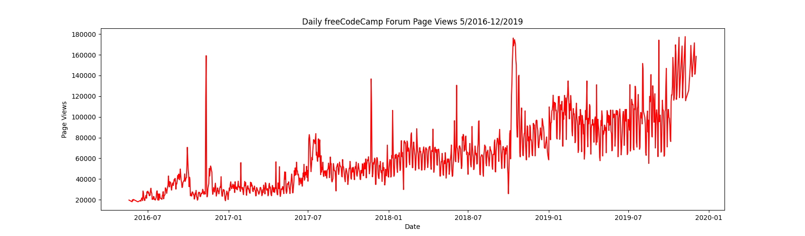
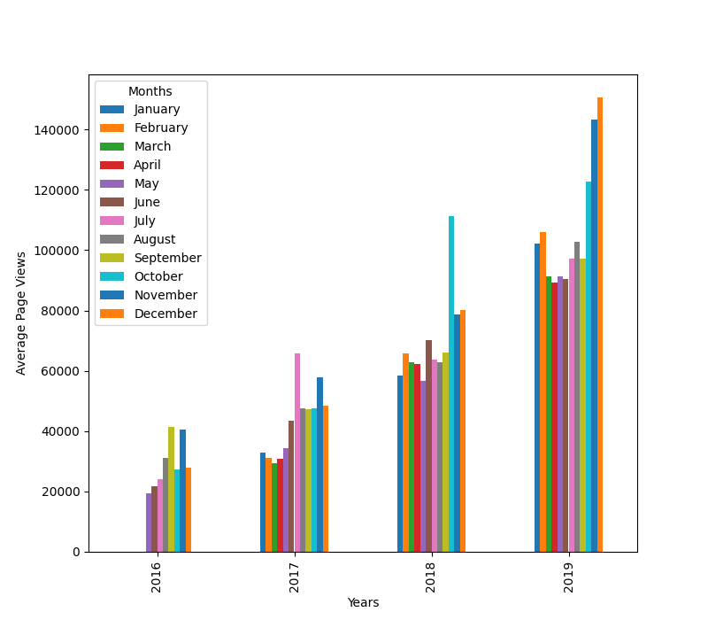
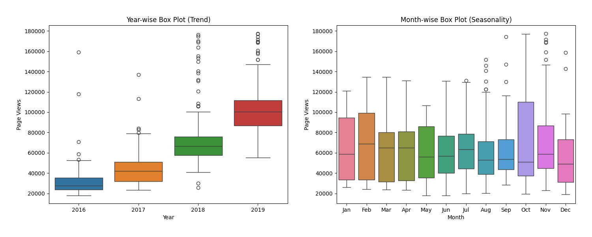

# Page View Time Series Visualizer
freeCodeCamp_Data Analysis with Python_Project 

Tools: Python, Pandas, Matplotlib, Seaborn

Summary: This project visualizes website page views over time to identify trends, seasonality, and outliers.

Analysis:
- Cleaned and filtered data to remove outliers
- Created a line chart, bar plot, and box plots to visualize temporal trends
- Analyzed seasonal variation and distribution by year and month

Key Skills: Time series visualization, outlier detection, seasonal trend analysis

